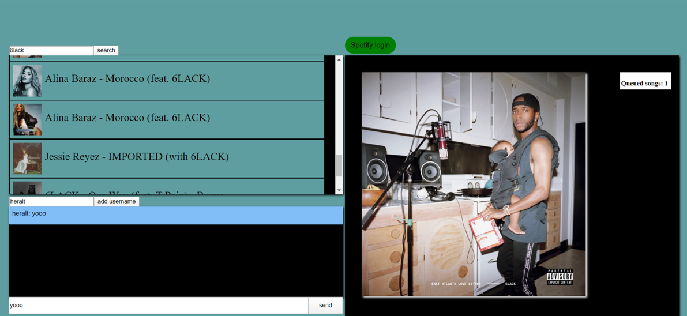

# Real-Time Web @cmda-minor-web · 2019-2020

During this course you will learn how to build a **meaningful** real-time application. You will learn techniques to setup an open connection between the client and the server. This will enable you to send data in real-time both ways, at the same time.

# Party app 
An app where people join a party and we all listen to the same music at the same time. Every person in that party can queue music to the 
party queue. And there is also a way to chat with each other.

## Site live

Link naar applicatie: [live link](https://chat-spotify.herokuapp.com/)

## table of content
- [Functionality](#Functionality)
- [API](#API)
- [Install project](#Install-project)
- [Realtime events](#Realtime-events)
- [Diagram](#Diagram)

## Functionality
- [x] Search for songs (**on the client**)
- [x] Add songs (**from client to server**)
- [x] Listen to songs (**Send from server to client**)
- [x] chat 
### nice to have 
- [ ] Rooms **socket.io**
## API
For this webapp I'm using the Spotify API. This api lets premium members create playlists, search for songs and add songs 
to playlists. I will be using these functionalities for my product. 
## Install project
```bash
#### Clone repository
git clone https://github.com/heralt/real-time-web-1920.git

cd real-time-web-1920

#### Install project and dependencies
npm install

#### run project
npm start
```
## Realtime events
Music events
### Client
- `Search song - /search?q=Song name&type=track`: send name of artist or song to this end point, with access token in header, to receive Json with 20 songs of the artist or the ammount of songs it can find with that song name. 
- `Play song - /me/player/play`: send uri of song in the fetch body with access token in header to start playing song in browser when connected to webplayback sdk.
- `Connect with webplayback sdk - player.connect()`: connects browser to webplayback sdk, music starts playing in browser. Browser is now active device.
- `Queue song: /me/player/queue?uri=Song`: puts song in queue. Will start playing song in active device using Spotify.
- `Disconnect from webplayback sdk - player.disconnect()`: if last song in queue is played, the app will disconnect from the webplayback sdk.
### Server
- `Fetch uri of song for queue or playing of song: tracks/song id`: when a song is being queued or needs to be played, song data is fetched using the song id.  
- `Keep track of ammount of queued songs`: when a song is queued value in server is updated and sent to connected sockets.

Message events
### Client
- `Sending message to server`: send chat message to server.
- `Receive message from server`: receives sent message from the server.
- `Send nieuw name to server`: send chat name to server.
### Server
- `Send message to connected sockets`: sends message to all connected sockets.
- `change name of socket`: changes name of socket from anonymous to the name received from the socket.

## Diagram

`This diagram shows the where what data lives and what data I will be using from the Spotify API. A lot of fetches are done in the client. Searching for songs, playing songs and queueing songs are also done in the client. The reason for this is that the webplayback sdk needs a device code to know where to send the audio to. I wasn't able to make the server a a device and send the audio, so I did it in the client.`
<!-- Add a link to your live demo in Github Pages 🌐-->

<!-- ☝️ replace this description with a description of your own work -->

<!-- replace the code in the /docs folder with your own, so you can showcase your work with GitHub Pages 🌍 -->

<!-- Add a nice image here at the end of the week, showing off your shiny frontend 📸 -->

<!-- Maybe a table of contents here? 📚 -->

<!-- How about a section that describes how to install this project? 🤓 -->

<!-- ...but how does one use this project? What are its features 🤔 -->

<!-- What external data source is featured in your project and what are its properties 🌠 -->

<!-- This would be a good place for your data life cycle ♻️-->

<!-- Maybe a checklist of done stuff and stuff still on your wishlist? ✅ -->

<!-- How about a license here? 📜  -->

[rubric]: https://docs.google.com/spreadsheets/d/e/2PACX-1vSd1I4ma8R5mtVMyrbp6PA2qEInWiOialK9Fr2orD3afUBqOyvTg_JaQZ6-P4YGURI-eA7PoHT8TRge/pubhtml
