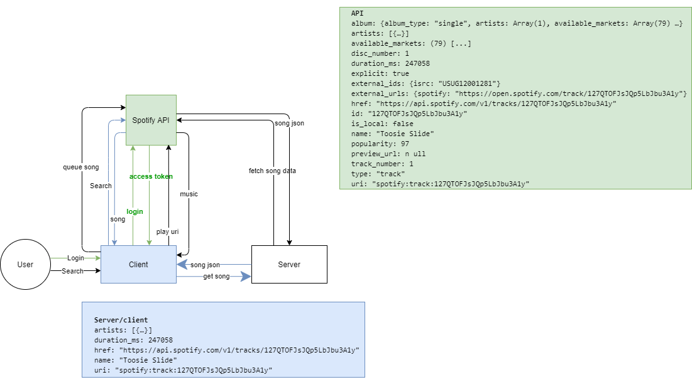

# Real-Time Web @cmda-minor-web · 2019-2020

During this course you will learn how to build a **meaningful** real-time application. You will learn techniques to setup an open connection between the client and the server. This will enable you to send data in real-time both ways, at the same time.

# Party app 
An app where people join a party and we all listen to the same music at the same time. Every person in that party can queue music to the 
party queue. And there is also a way to chat with each other.

# Site live
Link naar applicatie: [live link](https://chat-spotify.herokuapp.com/)

## table of content
- [Functionality](#Functionality)
- [API](#API)

## Functionality
- [x] Search for songs (**on the client**)
- [x] Add songs (**from client to server**)
- [x] Listen to songs (**Send from server to client**)
- [x] chat 
## nice to have 
- [ ] Rooms **socket.io**
#### API
For this webapp I'm using the Spotify API. This api lets premium members create playlists, search for songs and add songs 
to playlists. I will be using these functionalities for my product. 

## Diagram

This diagram shows the where what data lives and what data I will be using from the Spotify API.
<!-- Add a link to your live demo in Github Pages 🌐-->

<!-- ☝️ replace this description with a description of your own work -->

<!-- replace the code in the /docs folder with your own, so you can showcase your work with GitHub Pages 🌍 -->

<!-- Add a nice image here at the end of the week, showing off your shiny frontend 📸 -->

<!-- Maybe a table of contents here? 📚 -->

<!-- How about a section that describes how to install this project? 🤓 -->

<!-- ...but how does one use this project? What are its features 🤔 -->

<!-- What external data source is featured in your project and what are its properties 🌠 -->

<!-- This would be a good place for your data life cycle ♻️-->

<!-- Maybe a checklist of done stuff and stuff still on your wishlist? ✅ -->

<!-- How about a license here? 📜  -->

[rubric]: https://docs.google.com/spreadsheets/d/e/2PACX-1vSd1I4ma8R5mtVMyrbp6PA2qEInWiOialK9Fr2orD3afUBqOyvTg_JaQZ6-P4YGURI-eA7PoHT8TRge/pubhtml
